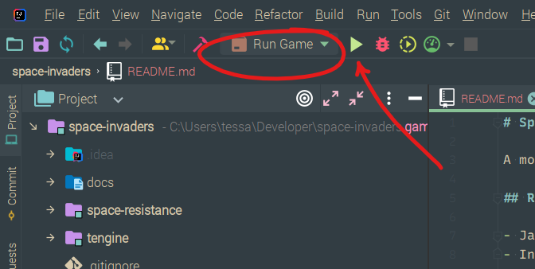

# Space Resistance

A modern remake of the classic Shoot 'em up game Space Invaders, built in Java.

## Requirements

- Java SE 17 or above
- IntelliJ (or Maven for command-line-only builds)

---

## How to Run Space Resistance

### Run with IntelliJ

This project was developed using the Maven build system. When first opening the project, you'll see the project
plugins and dependencies being downloaded. It may take a minute for the project to process and index all the build
files.

⚠️ Please do **not** delete the `.idea` directory—it contains the "Run Game" configuration necessary for you to
build and run the game.

When the project has loaded, you will find the Run Game configuration in the menu bar

- [ ] Replace this with an image showing the current project



### Run from Commandline

To build from the command-line only, you can use Maven, if you have it installed, and then run the `.JAR`
directly. Enter the following commands in the project root:

```shell
mvn install
java -jar space-resistance/target/space-resistance.jar
```

---

## Playing Space Resistance

A window should appear for you to play the game:

- [ ] Insert screenshot

The rules are simple:

- [ ] Fill this out 

### Space Resistance Features

- [ ] Fill this out 

### Future Improvements

- [ ] Fill this out 

---

## Architecture

### Overview

Space Resistance was developed with the minimum version of OpenJDK 17, and uses Maven to build the project including its
dependencies, and package it into an executable `.JAR`. The game engine used to develop Space Resistance is Tessa's 
external `TEngine` project, which has been included locally as a module to simplify the build process.

### Project Overview and Maven

The project is organised to work with the Maven build system—you can find all the source code in 
`./space-resistance/src/main/java/`.

Within the source files, there are the following packages:

- [ ] Add package diagram

### `TEngine`

The `TEngine` is Tessa's personal rebuild of the Massey GameEngine, loosely based on the ECS software architecture 
pattern. It's a work in progress, so the following is only a brief summary:

- Graphics Engine: Supported ✅
    - Drawing primitives: ovals, rectangles
    - Compound primitive containers
    - Text
    - Sprites
    - Animated Sprites & Sprite Sequences
    - Transforms
- Physics Engine: WIP ⚠️
- Audio: Supported ✅
- Actors & Actor Management: Supported ✅
- World Management: Supported ✅

### The `GameWorld`

The `GameWorld` coordinates the gameplay and manages the interactions between actors depending on the game 
configuration.

- [ ] Insert image of `GameWorld` class overview

- [ ] Insert image of sequence diagram for `GameWorld` managing interactions

### Screen Management

At a higher level than the `GameWorld` is the `PlayGameScreen`, which is, as the name suggests, the screen that is
loaded when the user starts playing the game. We also have the `MenuScreen`, which internally is made up of
smaller `Menu`s, and the `GameOverScreen`. To manage moving between all of these screens at a higher level, we have the
`Game` class, which extends the `TEngine` game engine, and is the entry point for the program. The `Game` is where we
initially set up everything needed for Space Resistance, and then it manages loading and unloading each of these 
screens. It then listens for callbacks from each screen to know when to transition and which screen to load next.


The first screen loaded is the `MenuScreen`, which lets the player select the game configuration and makes
that available to the `PlayGameScreen` through `Settings`. While the `PlayGameScreen` is loaded, it updates the
`GameState` so that when the game is over and the `GameOverScreen` is loaded, it can be passed the `GameState` and
display the results.

## Attributions

- ...
- ...
